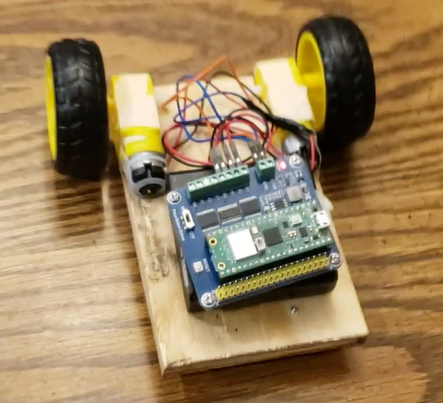
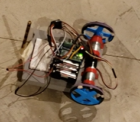

# 2024 Robot Tour Source Code

## About

The 2024 Robot Tour event challenged teams to create a robot which could navigate through a maze, and end on a target pointat a specified time. The robot could not be controlled during a run, so the path needed to be pre-programmed prior to a starting.Additionally, there were certain optional "Bonus Squares" which would give a team additional points if the robot could gotthrough it on it's path to the target.

I made this robot and it competed and placed well in competitions for the first half of the season, and it was programmed in
python. The final bot was done using Arduino setup with an Al image-recognition to locate the target point, and coded in C++.

## Final* Components
*components were upgraded over the course of the season
- Raspberry Pi Pico (Running Python Script)
- 3D-Printed Chasis
- Waveshare DC Motor Control Board
- MPU6050 Gyroscope/Accelerometer (not always used)
- HC SR04 Ultrasonic Sensor (not always used)
- 2x Bemonoc DC motor with Hall Effect Encoders

## Images

Initial Design:

Final Design:

